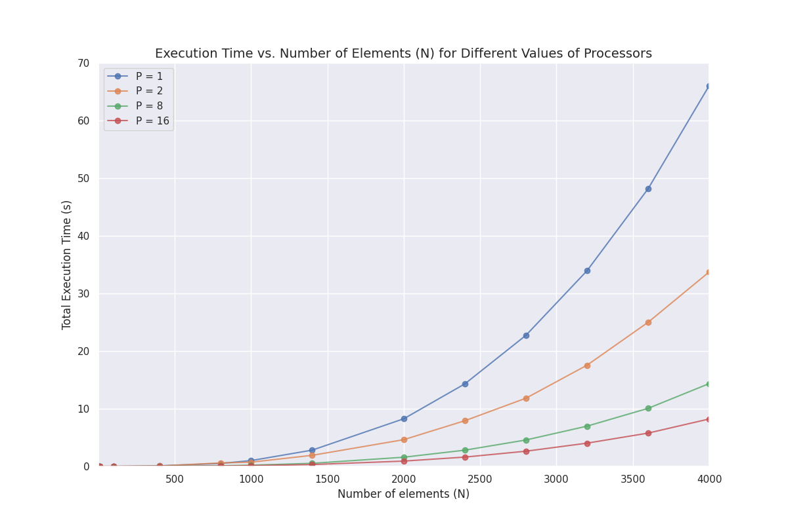

## Gaussian Elimination Using C and MPI ##

### Sequential Program: ###

    compile:
        gcc gaussian_elimination_sequential.c

    run:
        ./a.out n
            where n is number of dimensions

### Parallel Program: ###

    compile:
        gcc gaussian_elimination_parallel.c -lpthread -lm

    run:
        ./a.out d n
            where d is the number of dimensions and n is the number of threads

### Additional Materials: ###

    An additional script, written using Python, is included, which is used to plot
    graph seen in the project report. The program will display the graph during execution
    and save a copy as a PNG file.
    This includes the file plot.py (script) and an additional CSV file containing the
    data for multiple runs at different values of N and P.

    requirements:
        matplotlib, pandas, seaborn

    run:
        python3 plot.py

### Results ###

